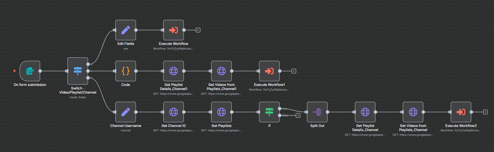
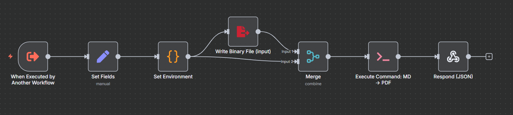

# Content-to-Insights — Skeleton (n8n → YouTube → Gemini → Sheets → MD/PDF)

Auto-summarises YouTube talks into clean, skimmable notes (MD → optional PDF) and tracks processed videos in a Google Sheet. Import the JSONs, wire your own credentials, and run.

## Problem → Action → Result → Learnings (concise)
**Problem** — Watching and filing each tech talk took ~4 hours; insights scattered across docs.  
**Action** — n8n workflows: collect new videos/playlists/channels → de-dup vs a `Videos` sheet → fetch transcript (Supadata) → Gemini summary (story-style + 5–7 bullets) → write Markdown (+ optional PDF).  
**Result** — ~4 hrs → 5 min; 30× faster research capture.  
**Learnings** — Practical ETL + API pagination; LLM prompt design; modular sub-flows in n8n.

## Run it yourself (5 steps)
1. **Import** the four JSONs from `workflow/` into n8n.
2. Open each **Execute Workflow** node and link the matching workflow by name (IDs intentionally blank).
3. Create a Google Sheet with tab `Videos`, then set env var `CTI_SHEETS_DOC_ID=<your-sheet-id>`.
4. (Optional file export) set:
   - `CTI_BASE_DIR=/path/cti`  → n8n will use `/path/cti/input` and `/path/cti/out`
   - `CTI_MD2PDF=/abs/path/md-to-pdf.mjs`
5. Trigger **Collect Videos** → it routes Video/Playlist/Channel, paginates playlists, de-dups against the Sheet, fetches transcripts, summarises with Gemini, and writes MD/PDF.

## Notes
- YouTube requests use OAuth creds (link your own in n8n). :contentReference[oaicite:3]{index=3}
- Playlist pagination is enabled for large lists. :contentReference[oaicite:4]{index=4}
- Transcript via Supadata; summary via Gemini; data is appended/updated in Sheet with columns: Summary, Key Learnings, Cleaned Markdown, etc. 

## License
MIT for code; docs/images CC BY 4.0 (edit if you prefer single-license).
